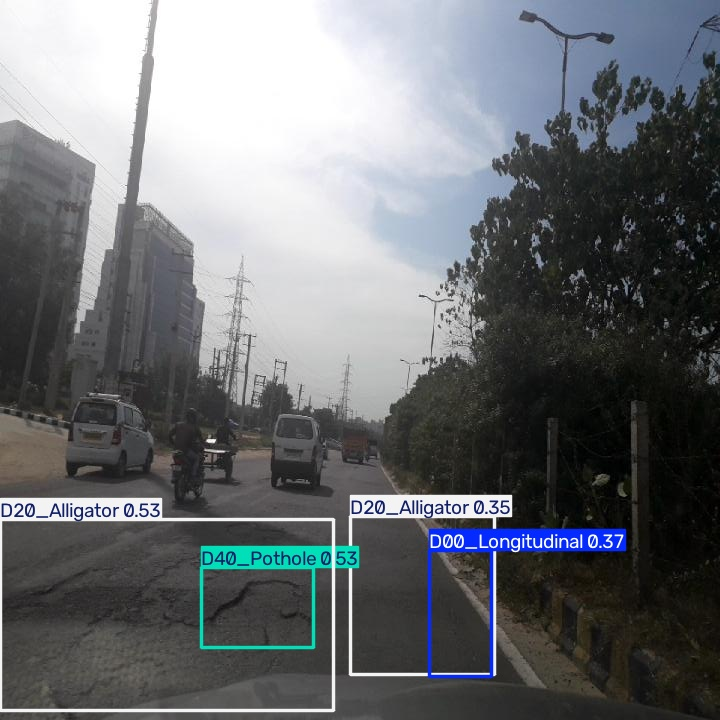
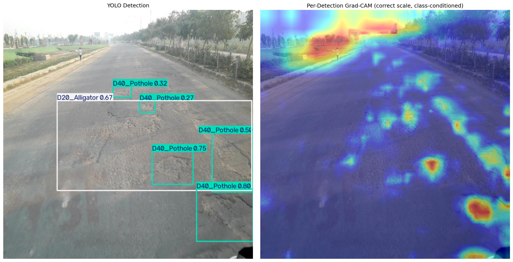

# Real-Time Road Damage Detection (YOLOv8n + Custom Grad-CAM)



Real-time multi-class road defect detection (cracks, potholes) for autonomous
vehicle perception. Fine-tuned YOLOv8n on a geographically filtered India+Japan
subset of RDD2022, featuring a custom-built per-detection Grad-CAM pipeline that
solves YOLOv8's non-differentiable NMS and multi-scale anchor problem — and
exported to a static ONNX graph for edge deployment.

**mAP@50: 0.718** | **D20 (Alligator Crack): 0.858 mAP@50** | **ONNX export: ~20ms/frame**

   

---

## The Engineering Problem

Autonomous vehicles and ADAS systems need more than "is there damage?" —
they need precise spatial localization to feed a path planner. This project
fine-tunes a lightweight, anchor-free YOLOv8n detector to classify and
localize four road damage types, optimized for a small memory footprint
suitable for edge/embedded deployment.

### Results (100 epochs, YOLOv8n, India+Japan subset)

| Class | Precision | Recall | mAP@50 | mAP@50-95 |
|---|---|---|---|---|
| **All classes** | **0.671** | **0.662** | **0.718** | **0.386** |
| D00 (Longitudinal) | 0.681 | 0.591 | 0.670 | 0.355 |
| D10 (Transverse) | 0.627 | 0.650 | 0.653 | 0.309 |
| D20 (Alligator) | 0.741 | 0.784 | **0.858** | **0.539** |
| D40 (Pothole) | 0.634 | 0.622 | 0.690 | 0.340 |

*D20 outperforms other classes — consistent with it being the most frequent
class in our training data (5,617 annotations vs. D10's 2,814). Generated by
`src/evaluate.py` against `yolov8n_kaggle_run/weights/best.pt` on the valid
split — see `results/metrics/metrics_summary.csv` for the source data.*

---

## Core Differentiator: Per-Detection Grad-CAM

Standard explainability methods fail on YOLOv8's anchor-free, multi-scale
architecture:

1. **EigenCAM** — PCA across the full feature map has no class or spatial
   conditioning. On outdoor road scenes, sky/glare regions dominate feature
   variance, so EigenCAM consistently highlighted the sky instead of the road.
2. **Naive Grad-CAM** — Backpropagating from `torch.max()` over the raw
   `[1, 8, 8400]` output tensor frequently selects a background anchor
   (saturated sigmoid → near-zero gradient → dead heatmap), or worse, a box
   *regression* channel instead of a class-confidence channel.

**The fix:** a custom per-detection Grad-CAM (`src/explainability.py`) that,
for each accepted YOLO detection:
1. Determines which multi-scale layer produced it (P3/stride-8, P4/stride-16,
   or P5/stride-32, based on box size) — YOLOv8 fuses three separate spatial
   scales, so a single global hook can't represent all detections correctly.
2. Backpropagates from that specific box's class logit — not a global max —
   through the correct scale's feature map.
3. Produces a heatmap conditioned on an actual accepted detection, not raw
   activation variance.

**Result:** heatmaps that correctly isolate road damage and ignore sky/background.



---

## Edge Deployment (ONNX)

Exported to a static ONNX graph (`src/export.py`) — batch=1, 640×640,
no dynamic axes (deliberate choice: this use case never needs variable
batch size, and static shape enables more aggressive graph optimization).
Runs via ONNX Runtime, dropping the PyTorch dependency entirely for
deployment. **Numerically verified against the original `.pt` model:
PASS — max absolute difference of 0.000061 across final detection outputs
(boxes, confidences, classes) on a real sample image, well within FP32
floating-point noise between PyTorch and ONNX Runtime kernels** (see
`src/export.py`'s `verify_parity()` and
`docs/learning/10-onnx-deployment.md` for the full worked check).

---

## Dataset & Constraint Handling

- **Geographic filtering:** RDD2022 spans ~47K images across 6 countries.
  Filtered to India+Japan (~14.6K images) to balance visual diversity
  against a 4GB VRAM local development constraint.
- **Compute pivot:** Local training repeatedly failed with RAM-exhaustion
  crashes during MixUp augmentation on the 4GB VRAM / 8GB RAM laptop
  (diagnosed as a real memory bottleneck, not a bug — see Lessons Learned).
  Training moved to Google Colab's free-tier T4 GPU (16GB VRAM) using the
  same `train.py`/configs unmodified — but that session disconnected before
  training finished, a common free-tier Colab failure mode. The final
  tracked run (`yolov8n_kaggle_run`, the weights used throughout this repo)
  completed on Kaggle Notebooks instead, a second free-tier GPU option with
  longer uninterrupted sessions.

---

## Repository Structure

```text
road-damage-detection-yolo/
├── assets/                  <- curated README images
├── configs/                 <- data.yaml, train/model configs
├── src/
│   ├── train.py
│   ├── evaluate.py
│   ├── explainability.py    <- custom per-detection Grad-CAM
│   ├── export.py            <- ONNX export
│   ├── inference.py         <- unified .pt/.onnx inference
│   └── augmentation.py
├── docs/
│   ├── blueprint.md
│   └── learning/            <- concept explainers (math + intuition)
├── results/
│   ├── gradcam_outputs/
│   ├── inference_samples/
│   └── visualizations/
├── notebooks/01_eda.ipynb
└── requirements.txt
```

---

## Quickstart

```bash
git clone https://github.com/RafadCherichi/road-damage-detection-yolo.git
cd road-damage-detection-yolo
pip install -r requirements.txt
python src/inference.py --weights results/training_runs/yolov8n_kaggle_run/weights/best.onnx --source data/raw/valid/images
```

---

## Lessons Learned

- **MixUp RAM crash:** Mosaic→MixUp chains hold two full mosaic-composited
  images in memory simultaneously. On an 8GB RAM laptop, this caused a
  `numpy.core._exceptions._ArrayMemoryError` mid-epoch-2 — traced to
  validation-phase memory stacking on top of training's own allocation,
  not a code bug. Disabled `mixup` locally; re-enabled once training moved
  to Colab's more generous memory.
- **Focal Loss deprecation:** Planned to use `fl_gamma` for the ~2:1 class
  imbalance (D20 vs. D10). Investigation of Ultralytics' `v8DetectionLoss`
  source showed Focal Loss is no longer wired into the standard training
  path in the installed version (8.4.x) — reverted to plain BCE, a
  documented and defensible tradeoff given the moderate imbalance.
- **Class mapping verification:** The dataset repackaging had no shipped
  `data.yaml`. Class order (D00-D40 → indices 0-3) was cross-validated
  against the original RDD2022 paper, the official sekilab repo, and an
  independent conversion repo — not assumed.
- **Non-deterministic plotting crash on local eval:** Ultralytics'
  confusion-matrix/PR-curve plotting (`plots=True`) crashed with no Python
  traceback on this laptop, 3/3 attempts, at a different point each time —
  consistent with a real race condition from the same dual-OpenMP-runtime
  situation as the MixUp crash (`KMP_DUPLICATE_LIB_OK=TRUE` suppresses
  Intel's safety check but doesn't fix the underlying conflict). Numeric
  metrics computation is unaffected and reproduced identically across
  multiple runs; `src/evaluate.py` defaults `plots` off locally as a result.

---

## Future Work
- Instance segmentation extension (Mask R-CNN)
- TensorRT export for NVIDIA edge deployment
- Integration with a downstream path-planning simulation
